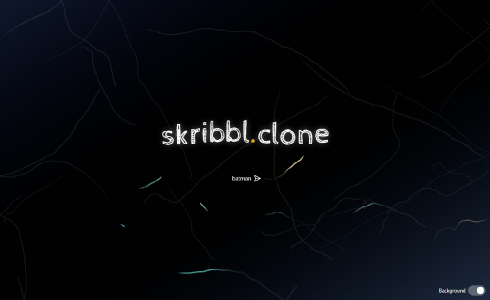

# scribbl.clone

I made this scribbl clone when I was getting bored at my internship for the 7 of us interns to pass our time whenever we felt bored as we didn't had access to [scribbl.io](https://skribbl.io) on our computers.

---

### setup

- frontend
  ```
  npm i
  npm run dev
  ```
  - frontend should be at [http://localhost:6969](http://localhost:6969)
- backend

  ```
  npm i
  node index.js
  ```

  - backend should be at [http://localhost:6968](http://localhost:6968)

---

### screenshots

- Landing Page
  

- Gameplay
  

---

### limitation 1

- This clone was made mainly for us to play on our locally connected computers. So, this works best only when backend is locally running as you'll get zero latency.

- If you decide to host it on a server, you should expect some latency on drawer side.

- This is because even when the user draws something, it would appear on the screen only after the server would send it back to everyone (~~yes I was too lazy to make two functions for drawers and guessers~~).

### limitation 2

- No option for multiple rooms.

- Basically you'll have to host multiple instances of the game to make multiple rooms. We never needed multiple rooms functionality, so I never implemented it.

### limitation 3

- The background is too good. **And with too good background comes too good CPU usage.**

- If you feel the drawing canvas is lagging, there is option to disabel the background.

---

### sidenote

This was made for us to have fun and I was pretty sure I would make this in like 2 hours and decided not to initiate a git repo untill now, so the first commit sucks and you won't be able to see how I created it. And most of the things are not optimised. But everything is working :)
